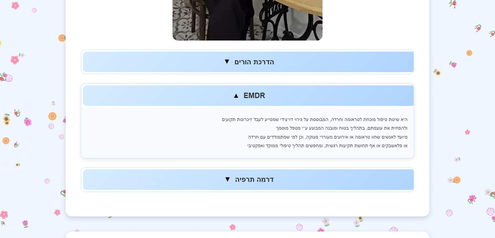
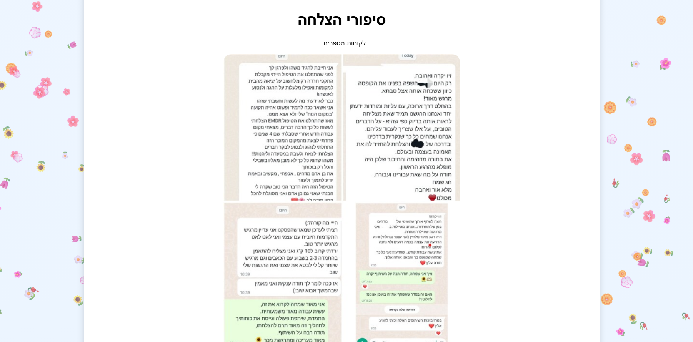
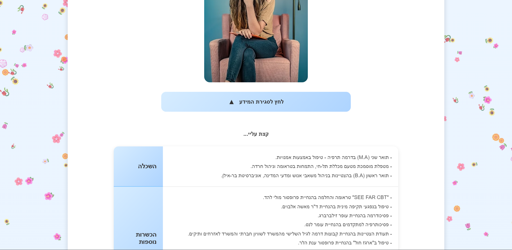
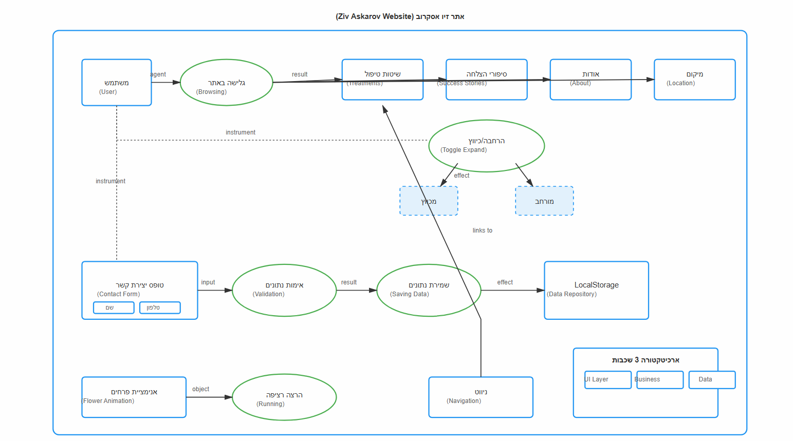

# Askarov Architecture Portfolio


# 🏛️ Architecture & Design Portfolio: Askarov

[](https://opensource.org/licenses/MIT)
[](https://zivaskarov.vercel.app/)

A high-end architectural showcase designed to bridge the gap between structural engineering and aesthetic design. This repository hosts the digital portfolio of **Ziv Askarov**, featuring clean UI/UX, responsive layouts, and technical diagrams.

## 🔗 Live Production URL
**Explore the Live Site:** [https://zivaskarov.vercel.app/](https://zivaskarov.vercel.app/)

---

## 📖 Project Overview

This project serves as a comprehensive digital exhibition. It is designed to handle high-resolution architectural renders while maintaining fast performance and a minimalist aesthetic that puts the focus on the work.

### Key Features:
* **Minimalist UI:** Focuses on negative space and typography to reflect architectural principles.
* **Technical Documentation:** Includes high-level OPM (Object-Process Methodology) diagrams for structural clarity.
* **Fully Responsive:** Optimized for desktop monitors, tablets, and mobile devices.
* **Optimized Performance:** Fast asset loading hosted via Vercel’s Edge Network.

---

## 📸 Visual Showcase

### Interface Preview
| Desktop View | Mobile Experience |
| :--- | :--- |
|  |  |

### Design Details
| Feature Section | Branding & Layout |
| :--- | :--- |
|  |  |

### Technical Architecture
> **OPM-Diagram:** Detailed logic and structural flow of the architectural methodology.


---

## 🛠️ Tech Stack & Methodology

* **Frontend:** HTML5 (Semantic), CSS3 (Flexbox/Grid), JavaScript (ES6+).
* **Design Tools:** Focused on clean, grid-based architectural layouts.
* **Deployment:** Automated CI/CD via **Vercel** integration with GitHub.

---

## 📁 Repository Structure

```text
Architecture/
└── Askarov/
    ├── index.html          <-- Main entry point
    ├── css/                <-- Stylesheets
    ├── js/                 <-- Interactive logic
    ├── screenshots/        <-- Portfolio previews
    └── assets/             <-- Architectural renders & images
```

---

## 👤 Contact & Development

| Role | Information |
| :--- | :--- |
| **Lead Developer/Designer GitHub** | [Oratias07](https://github.com/Oratias07) |
| **LinkedIn** | [@Oratias07](https://www.linkedin.com/in/oratias07) |
| **Project Name** | Askarov Architecture Showcase |
| **Status** | Production Ready |

<p align="center">
  <br />
  <b>© 2024 Askarov Architecture. <br>All rights reserved.</b>
</p>
